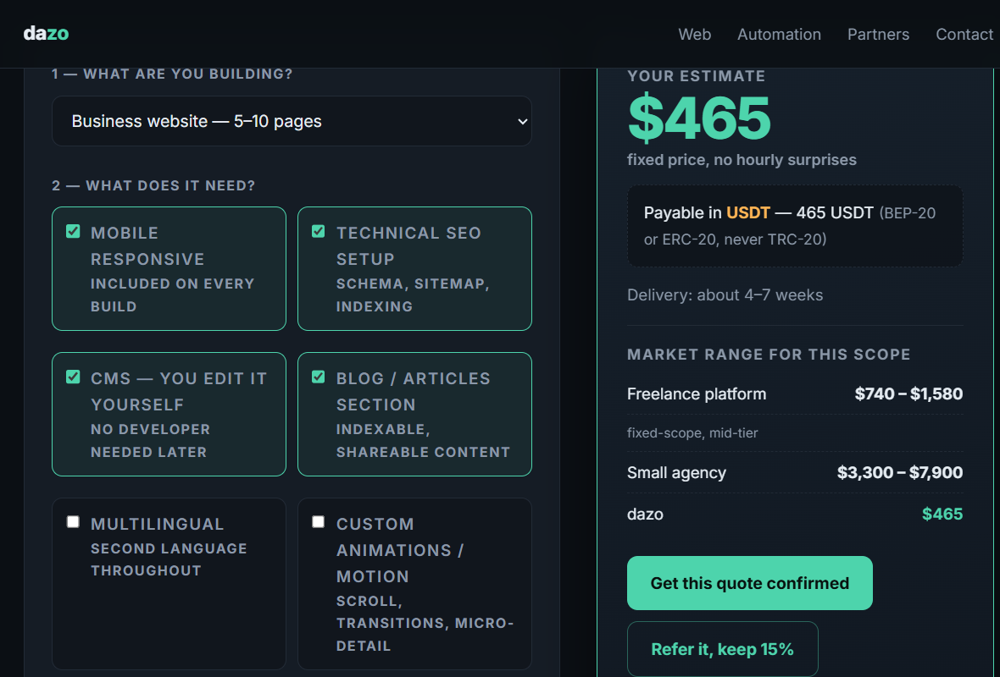

# dazo cost calculators

[](LICENSE)
[](#whats-in-this-repo)
[](#whats-in-this-repo)

Two standalone HTML pricing calculators. Drop either file on any static host and it
works — no build step, no framework, no npm install, no analytics, no request that
leaves the browser.

<p align="center">
  
</p>

**[Live demo →](https://fyosamu.github.io/tools/website-cost-calculator/)** ·
**[Bot calculator →](https://fyosamu.github.io/tools/telegram-bot-cost-calculator/)**

---

## Why these exist

Most agency sites hide pricing behind a contact form, because the standard playbook
is: quote high, negotiate down, and hope nobody compares you.

This studio does the opposite. Every price is published, and these two calculators
turn it into something you can use without talking to anyone — pick scope, get a
fixed number, and see a market range next to it so you can tell whether a quote
you've *already* been given is reasonable.

The market ranges are indicative, derived from the usual fixed-scope pricing bands
(freelance platform, small agency). They are there so you can check a quote, not as
a promise from anyone. The studio's own figure is its actual published price.

---

## What's in this repo

| File | What it does |
|---|---|
| `calculators/website-cost-calculator.html` | Scope → price. Base type, 8 feature toggles, optional app build, optional care plan. Outputs USD + USDT, delivery window, and the market range. |
| `calculators/telegram-bot-cost-calculator.html` | Features + message volume → build price and realistic monthly hosting. 6 bot types, 8 features, 4 volume tiers. |
| `assets/calculator.png` | Screenshot used above. |
| `index.html` | A tiny hub page so this repo can be served as-is (see *Live demo* above once GitHub Pages is on). |

Both calculators are **one HTML file each** — markup, styles, and the calculation
script inline. That is the whole point: you can read the maths.

---

## Run it

No tooling. Open the file:

```bash
git clone https://github.com/Fyosamu/dazo-cost-calculators.git
cd dazo-cost-calculators
start calculators\website-cost-calculator.html     # Windows
open  calculators/website-cost-calculator.html     # macOS
```

Or serve the folder if you'd rather:

```bash
python -m http.server 8080
# http://localhost:8080/calculators/website-cost-calculator.html
```

---

## Use it on your own site

Three ways, in order of least effort.

**1. Host the file.** Upload the HTML anywhere that serves static files — GitHub
Pages, Netlify, Cloudflare Pages, S3, a plain nginx directory. The footer link back
to the studio is the attribution; leave it if you can, it's what makes this free.

**2. Iframe it.**

```html
<iframe
  src="https://fyosamu.github.io/tools/website-cost-calculator/"
  style="width:100%;min-height:820px;border:0"
  loading="lazy"
  title="Website cost calculator"></iframe>
```

**3. Copy the markup.** Everything is inside one file, so copy the `<style>`, the
markup, and the `<script>` block at the bottom into your own page. It uses plain
selectors (`#type`, `#extras input`, `#price`) and no globals — the whole thing is
wrapped in one IIFE.

---

## Change the prices

The numbers live in exactly two places. There is no config file on purpose.

### Website calculator

Find the `<script>` at the bottom. The relevant lines:

```js
var base     = { landing:450, business:850, ecommerce:1550, webapp:2250, migration:700 };
var baseWeeks= { landing:1,   business:2,   ecommerce:3,    webapp:4,    migration:2    };
```

- **`base`** — starting price per project type (USD).
- **`baseWeeks`** — starting delivery time in weeks.

Feature prices are attributes on the checkboxes themselves, so they're editable
without touching JS:

```html
<label class="opt">
  <input type="checkbox" data-price="180" data-weeks="1" data-label="Technical SEO setup">
  ...
</label>
```

| Attribute | Meaning |
|---|---|
| `data-price` | added to the total, USD |
| `data-weeks` | added to the delivery window, weeks |

The market-range comparison is a set of multipliers on the total — `frLo/frHi`
(freelance) and `agLo/agHi` (agency). Change the ratios, not the output variables.

### Bot calculator

```js
var base  = { info:350, support:540, sales:630, notify:420, admin:720, store:1000 };
var baseW = { info:3,   support:5,   sales:5,   notify:4,   admin:6,   store:7    };
```

Message-volume surcharges are on the `#volume` `<option>`s (`value="135"` = +$135).
Hosting is derived, and deliberately *not* scaled with labour:
`hostLo = 4 + round(volAdd / 9)`.

---

## Design notes

- **No dependencies.** Fonts load from Google Fonts with a system-font fallback; if
  that request fails the page still lays out correctly.
- **Nothing is collected.** No form posts, no `fetch`, no cookies, no storage. You
  can confirm it by reading the file — there is no network call in it.
- **Both pages carry JSON-LD** (`WebApplication` + `FAQPage`) so they produce rich
  results if you serve them.
- **Responsive** down to ~360px; the result panel becomes `position: static` under
  860px.
- **Each file is self-contained**, so a fork can't break on a missing asset.

---

## Contributing

Issues and pull requests are welcome — especially:

- better or better-sourced market ranges (they are the weakest part of this, and the
  part most likely to be wrong),
- currencies other than USD,
- a third calculator. Open one first so nobody builds it twice.

---

## About the studio that built these

**[dazo](https://fyosamu.github.io/)** — a one-person remote build studio.

| Service | Price | Turnaround |
|---|---|---|
| Custom website (theme or fully bespoke) | **$450** | 3–7 days |
| Existing website → Android / iOS app | **$600** | 4–8 days |
| Telegram or Discord bot | **$350** | 2–5 days |
| AI workflow automation | **$550** | 3–7 days |
| Technical SEO audit and fixes | **$300** | scoped per site |
| Speed optimisation (Core Web Vitals) | **$250** | 1–3 days |
| Care plan — updates, backups, fixes | **$90 / mo** | ongoing |

Prices are fixed-scope and quoted before work starts. Payment in **USDT** —
BEP-20 or ERC-20 only, never TRC-20.

Send work the studio's way and keep **15%** of the fee —
**[partner program →](https://fyosamu.github.io/partners/)**

**[fyosamu.github.io](https://fyosamu.github.io/)** ·
**[hkay7645@gmail.com](mailto:hkay7645@gmail.com)**

---

## License

[MIT](LICENSE). Use it, change it, sell with it. A link back is appreciated and is
the only thing asked for.
